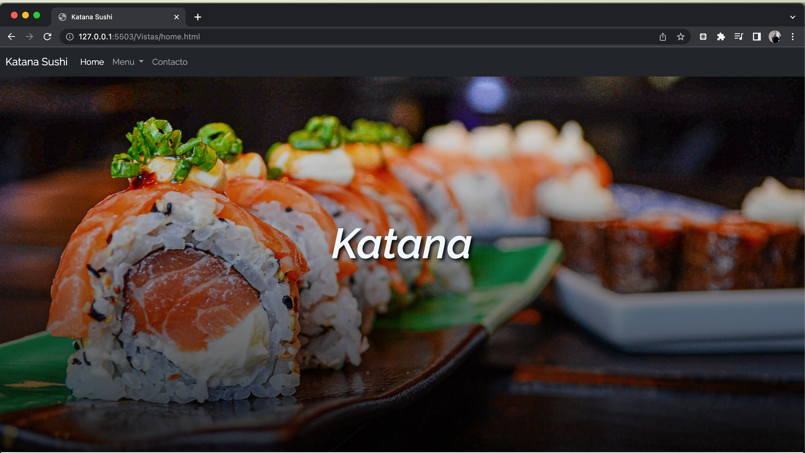
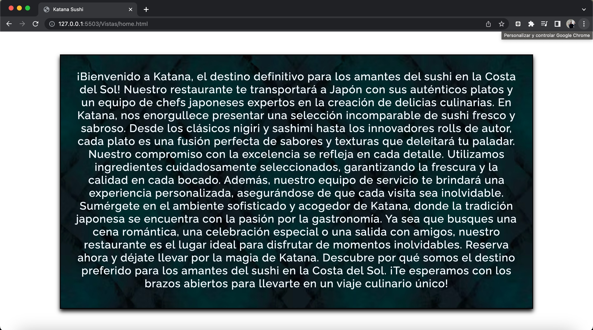
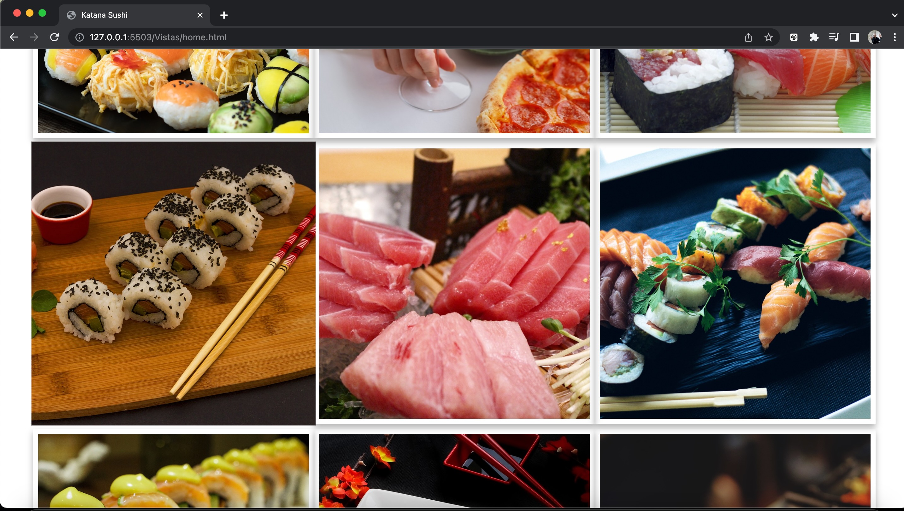
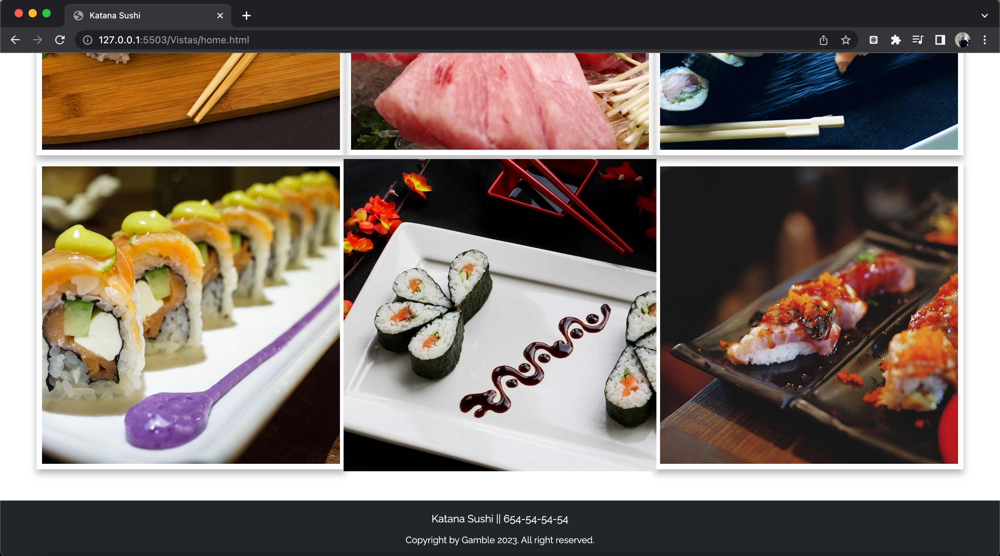
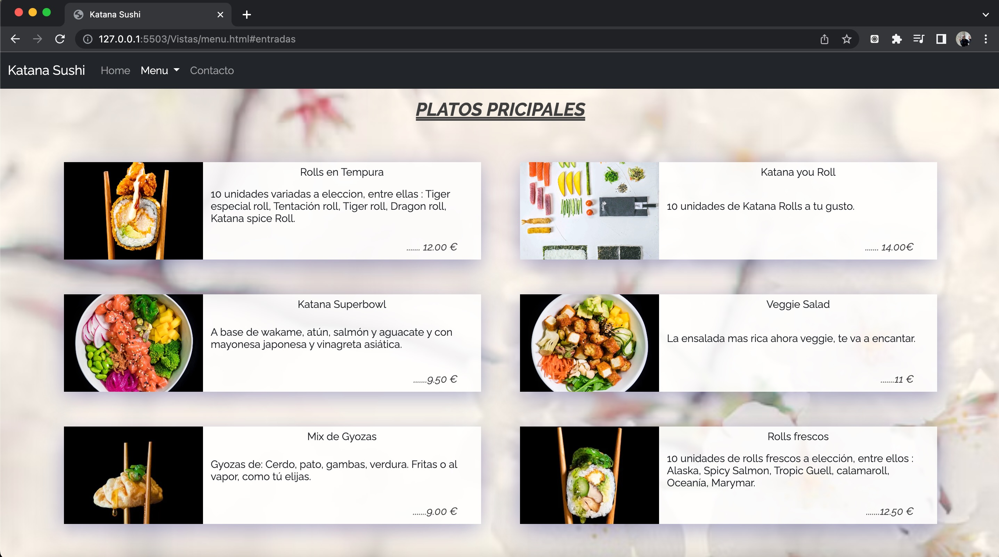
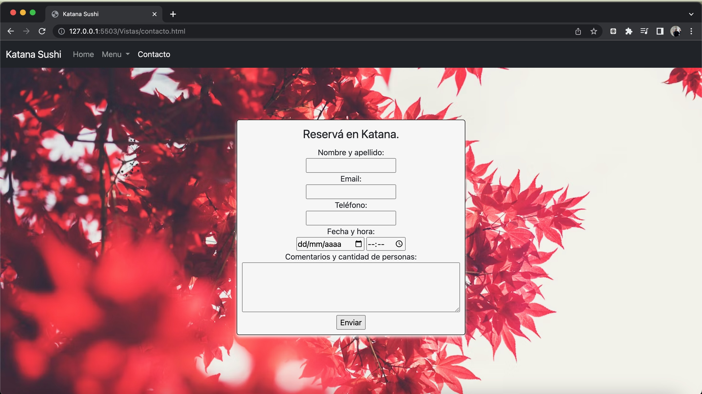

# Proyecto restaurante Katana.

**Proyecto realizado para el bootcamp Frontend Developer en Geekshub**

Se realiza pagina web responsive para un restaurante con las tecnologias:

- Html 5
- Css 3
- Bootstrap 5.3.

_Html + Bootstrap_
Se realizaron 3 vistas en ellas coinciden:
En el Navbar,se utilizo Bootstrap 5.3, modificandolo para que se adapte al proyecto en cuanto a colores y funcionalidad. Cuenta con tres secciones (Home, Menu (Entradas, Platos principales y Postres) y contacto. Se vinculó la navegacion entre paginas y enlazado el atributo Active para identificar donde estas situado en la pagina.

En la vista _Home_ cuenta con:

- Imagen principal.
- About: Informacion del restaurante.
- Galeria de fotos con Grid.

En la vista _Menú_ se utilizó grid para definir el posicionamiento y luego se utilizaron cards de Bootstrap para la descripcion del menú.

En la vista _Contacto_ se realizo un formulario realizado en Html y estilizado con css, el formulario envia un mail a la direccion de correo del cliente, con el atributo= mailto.

**Css3**
Se realizo la pagina teniendo en cuenta la estrategia de diseño Mobile first y siendo completamente responsive.
Se usaron efectos como: hover (leve movimiento superior de una foto, al posicionarlo), gradient(para mejorar la vista de un texto y la transicion a otro elemento) y sombras para estilizarlos.

**Sobre mí**

Soy Maxi chavez y tengo 34 años, actualmente estoy cursando el Bootcamp Frontend Developer, vivo en Málaga. Estoy muy entusiasmado con los nuevos proyectos.

chavezmaxi@gmail.com

_Tecnologias._

